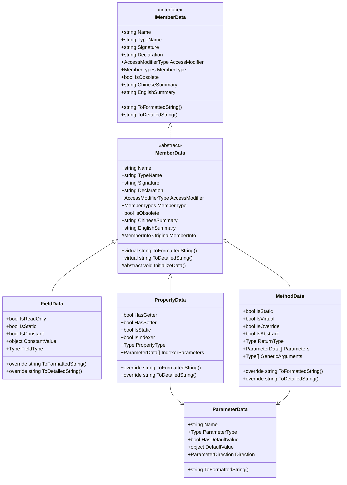
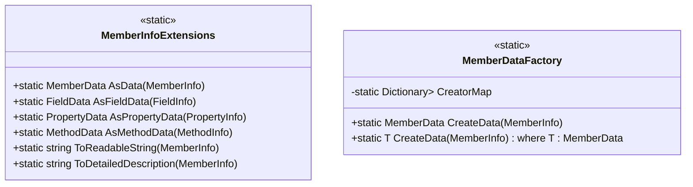
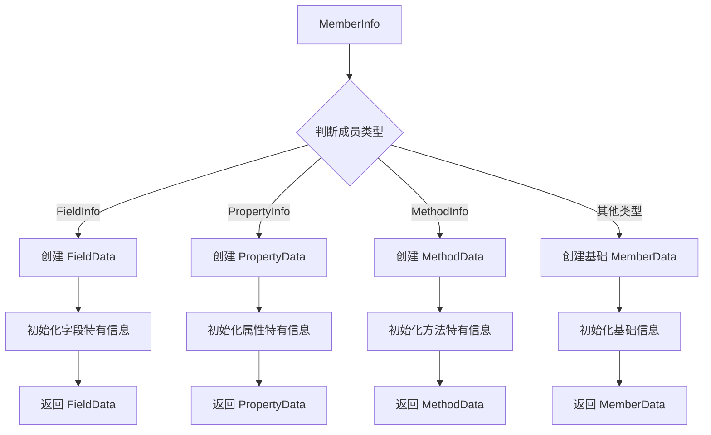

# 成员信息数据类设计文档

## 概述

本设计文档描述了一个用于封装和处理 .NET 反射成员信息的数据类系统。该系统将为 `MemberInfo`、`FieldInfo`、`PropertyInfo`、`MethodInfo` 等反射类型提供统一的数据封装接口，作为文档生成和信息展示的中间数据层，并通过静态扩展方法实现便捷的转换功能。

### 设计目标

- 提供结构化的成员信息数据封装
- 统一的接口设计支持不同类型的反射成员
- 便捷的静态转换方法
- 作为文档生成的中间数据层
- 可扩展的架构支持未来新增成员类型
- 与现有 OdinToolkits 项目的 TypeAnalyzer 模块兼容

## 架构设计

### 核心类层次结构



### 静态扩展方法设计



## 核心接口定义

### IMemberData 接口

| 属性名 | 类型 | 描述 |
|--------|------|------|
| Name | string | 成员名称 |
| TypeName | string | 成员类型名称 |
| Signature | string | 成员签名 |
| Declaration | string | 成员完整声明 |
| AccessModifier | AccessModifierType | 访问修饰符类型 |
| MemberType | MemberTypes | 成员类型枚举 |
| IsObsolete | bool | 是否已过时 |
| ChineseSummary | string | 中文描述 |
| EnglishSummary | string | 英文描述 |

| 方法名 | 返回类型 | 描述 |
|--------|----------|------|
| ToFormattedString() | string | 生成格式化的字符串 |
| ToDetailedString() | string | 生成详细的描述字符串 |

## 具体实现类设计

### FieldData 类

专门用于封装字段信息的数据类，扩展了基础成员信息。

| 特有属性 | 类型 | 描述 |
|----------|------|------|
| IsReadOnly | bool | 是否为只读字段 |
| IsStatic | bool | 是否为静态字段 |
| IsConstant | bool | 是否为常量字段 |
| ConstantValue | object | 常量值（如果是常量） |
| FieldType | Type | 字段类型 |

**显示格式示例：**
- 格式化输出：`public readonly string fieldName`
- 详细输出：`[访问修饰符] [修饰符] [类型] [字段名] : [描述]`

### PropertyData 类

专门用于封装属性信息的数据类。

| 特有属性 | 类型 | 描述 |
|----------|------|------|
| HasGetter | bool | 是否有 getter |
| HasSetter | bool | 是否有 setter |
| IsStatic | bool | 是否为静态属性 |
| IsIndexer | bool | 是否为索引器 |
| PropertyType | Type | 属性类型 |
| IndexerParameters | ParameterData[] | 索引器参数（如果是索引器） |

**显示格式示例：**
- 格式化输出：`public string PropertyName { get; set; }`
- 详细输出：`[访问修饰符] [类型] [属性名] { [访问器] } : [描述]`

### MethodData 类

专门用于封装方法信息的数据类。

| 特有属性 | 类型 | 描述 |
|----------|------|------|
| IsStatic | bool | 是否为静态方法 |
| IsVirtual | bool | 是否为虚方法 |
| IsOverride | bool | 是否为重写方法 |
| IsAbstract | bool | 是否为抽象方法 |
| ReturnType | Type | 返回类型 |
| Parameters | ParameterData[] | 方法参数 |
| GenericArguments | Type[] | 泛型参数 |

**显示格式示例：**
- 格式化输出：`public void MethodName(int param1, string param2)`
- 详细输出：`[访问修饰符] [修饰符] [返回类型] [方法名]([参数列表]) : [描述]`

### ParameterData 类

用于封装参数信息的数据类。

| 属性名 | 类型 | 描述 |
|--------|------|------|
| Name | string | 参数名称 |
| ParameterType | Type | 参数类型 |
| HasDefaultValue | bool | 是否有默认值 |
| DefaultValue | object | 默认值 |
| Direction | ParameterDirection | 参数方向（in/out/ref） |

## 静态扩展方法规范

### AsData 系列方法

为 MemberInfo 及其子类提供便捷的转换方法：

| 方法签名 | 适用类型 | 返回类型 | 描述 |
|----------|----------|----------|------|
| AsData(this MemberInfo) | MemberInfo | MemberData | 通用转换方法 |
| AsFieldData(this FieldInfo) | FieldInfo | FieldData | 字段专用转换 |
| AsPropertyData(this PropertyInfo) | PropertyInfo | PropertyData | 属性专用转换 |
| AsMethodData(this MethodInfo) | MethodInfo | MethodData | 方法专用转换 |

### 便捷格式化方法

| 方法签名 | 返回类型 | 描述 |
|----------|----------|------|
| ToReadableString(this MemberInfo) | string | 生成可读的简洁字符串 |
| ToDetailedDescription(this MemberInfo) | string | 生成详细的描述字符串 |

## 工厂模式实现

### MemberDataFactory 设计

采用工厂模式统一管理不同类型的 MemberData 创建：



## 与现有代码集成

### 与 TypeAnalyzer 模块的兼容性

该设计充分考虑了与现有 `MemberAnalysisData` 类的兼容性：

| 现有功能 | 新设计对应 | 复用策略 |
|----------|------------|----------|
| MemberAnalysisData | MemberData | 继承现有属性结构 |
| ChineseSummaryAttribute | ChineseSummary 属性 | 复用现有属性获取逻辑 |
| EnglishSummaryAttribute | EnglishSummary 属性 | 复用现有属性获取逻辑 |
| AccessModifierType | AccessModifier 属性 | 直接复用现有枚举 |
| TypeAnalyzerUtility | MemberDataFactory | 复用类型解析逻辑 |

### 命名约定

基于项目的命名规范和功能特点，推荐的类命名：

| 类名 | 说明 | 命名理由 |
|------|------|----------|
| `MemberData` | 基础成员数据类 | 简洁明确，表示成员信息数据 |
| `FieldData` | 字段数据类 | 与 FieldInfo 对应，简短实用 |
| `PropertyData` | 属性数据类 | 与 PropertyInfo 对应，简短实用 |
| `MethodData` | 方法数据类 | 与 MethodInfo 对应，简短实用 |
| `IMemberData` | 成员数据接口 | 统一的数据接口规范 |

## 使用示例

### 基本使用场景

```
// 字段信息封装
FieldInfo fieldInfo = typeof(MyClass).GetField("myField");
FieldData fieldData = fieldInfo.AsFieldData();
string formattedField = fieldData.ToFormattedString();
// 输出：public readonly string myField

// 属性信息封装  
PropertyInfo propInfo = typeof(MyClass).GetProperty("MyProperty");
PropertyData propData = propInfo.AsPropertyData();
string detailedProp = propData.ToDetailedString();
// 输出：public string MyProperty { get; set; } : 我的属性

// 方法信息封装
MethodInfo methodInfo = typeof(MyClass).GetMethod("MyMethod");
MethodData methodData = methodInfo.AsMethodData();
string formattedMethod = methodData.ToFormattedString();
// 输出：public void MyMethod(int param1, string param2)
```

### 批量处理场景

```
// 获取类型的所有成员并转换为数据格式
Type targetType = typeof(MyClass);
MemberInfo[] members = targetType.GetMembers();

foreach (MemberInfo member in members)
{
    MemberData memberData = member.AsData();
    Console.WriteLine(memberData.ToDetailedString());
}
```

## 扩展性设计

### 支持新成员类型

通过工厂模式和接口设计，系统可以轻松扩展支持新的成员类型：

1. 实现 `IMemberData` 接口
2. 继承 `MemberData` 抽象类
3. 在 `MemberDataFactory` 中注册新的创建器
4. 添加对应的扩展方法

### 自定义显示格式

通过重写 `ToFormattedString()` 和 `ToDetailedString()` 方法，可以自定义不同成员类型的输出格式。

### 本地化支持

设计预留了中英文双语支持，可以根据当前语言环境选择合适的显示文本。

## 单元测试策略

### 测试覆盖范围

| 测试类别 | 测试内容 | 预期结果验证 |
|----------|----------|--------------|
| 基础功能测试 | 各种成员类型的转换 | 正确创建对应的 Data 对象 |
| 格式化输出测试 | ToFormattedString 输出 | 符合预期的格式 |
| 详细信息测试 | ToDetailedString 输出 | 包含完整的成员信息 |
| 边界条件测试 | null 值、特殊成员处理 | 优雅的错误处理 |
| 性能测试 | 大量成员批量转换 | 满足性能要求 |
| 兼容性测试 | 与现有 TypeAnalyzer 集成 | 无冲突，功能正常 |

### 测试数据设计

设计包含各种成员类型的测试类，覆盖：
- 不同访问修饰符的成员
- 静态和实例成员
- 泛型方法和属性
- 带默认参数的方法
- 索引器属性
- 常量和只读字段